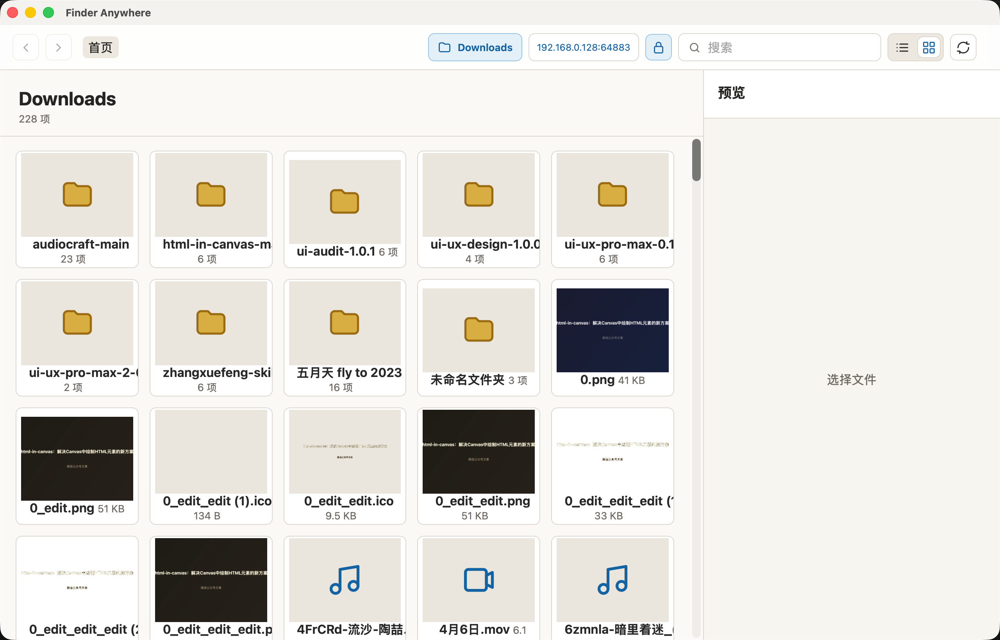
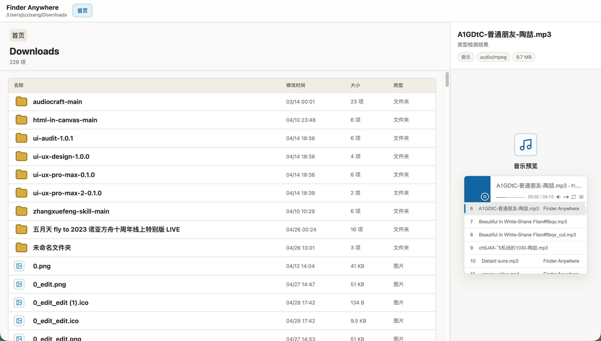
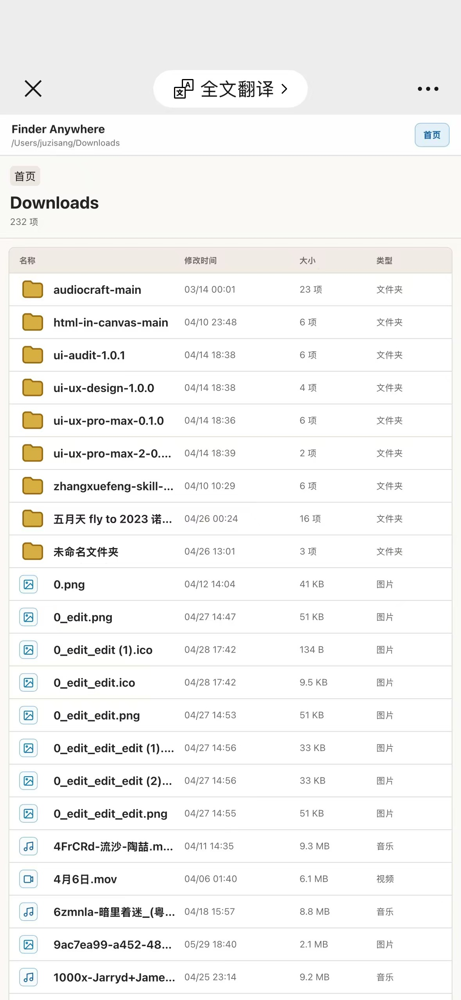

# oFinder

一个基于 Tauri 的本地文件浏览与局域网共享工具。

## 界面预览

| 本地浏览-桌面端             | 局域网共享-PC端             | 局域网共享-移动端           |
| --------------------------- | --------------------------- | --------------------------- |
|  |  |  |

## 功能

### 文件浏览

- 浏览本地文件系统目录
- 目录优先、按字母排序
- 网格 / 列表两种视图切换
- 面包屑导航
- 前进 / 后退历史
- 文件搜索过滤

### 文件预览

- **图片** — 缩略图生成（image crate），支持 jpeg/png/bmp/tiff/webp，点击全屏浏览，触摸滑动切换
- **音频** — 内置 APlayer，支持播放列表、上一首/下一首，移动端全屏播放器
- **视频** — 原生 `<video>` 控件播放
- **PDF** — iframe 内联预览
- **文本** — 文件内容读取展示（2MB 以内）

### 局域网共享

- 内置 HTTP 服务器，一键分享当前目录到局域网
- 移动端自适应布局
- 图片全屏 lightbox（桌面 + 移动端）
- 音频移动端全屏播放器
- 端口锁定功能，重启后保留配置

### 跨平台

- 支持 macOS 和 Windows
- 配置存储于系统标准配置目录（`oFinder/config.json`）
- 图片缓存存储于系统缓存目录

## 技术栈

- **前端**: Vanilla JS, Vite, APlayer
- **后端**: Rust, Tauri 2
- **图片处理**: `image` crate
- **文件图标**: 内联 SVG
